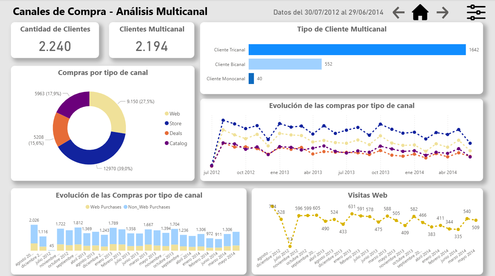
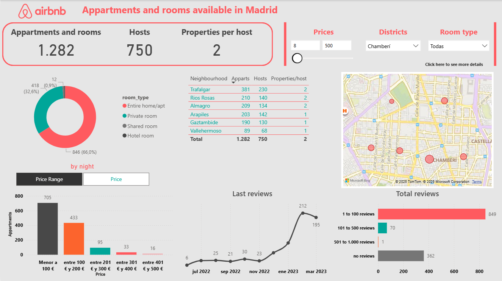

# 🚀 Portfolio de Análisis de Datos

¡Hola! Soy Ezequiel, Profesional del Marketing con más de 10 años de trayectoria y experiencia en posiciones de análisis de datos e inteligencia de negocio.
Este portfolio reúne mis principales proyectos personales en análisis y visualización de datos.

---
## 📌 Proyectos

### 1. Dashboard de Marketing
**Descripción:**  
Reporte en Power BI que analiza datos de clientes y compras para entender patrones de consumo y comportamiento.  

**Objetivos:**  
- Identificar gasto total, número de compras y ticket medio.  
- Analizar la segmentación por edades, estado civil, cantidad de hijos, educación y nivel de ingresos.  
- Evaluar el comportamiento multicanal.  
- Detectar los productos con mayor ticket medio.  

**Herramientas utilizadas:**  
- Python (Limpieza y preparación de los datos).
- BigQuery (almacenamiento y preparación de los datos).
- Power BI (modelado, DAX, visualizaciones).  
  
**Principales insights:**  
- Alta proporción de clientes multicanal.  
- Vinos y carnes concentran gran parte del ticket medio.  
- Diferencias claras en el gasto según perfil demográfico.  

**Vista previa:**  

**Ver más:**  
### 📂 Detalle del proyecto
- 📊 [Dataset (CSV)](marketing_campaign.csv)  
- 🐍 [Script en Python](analisis_marketing.py)  
- 🗄️ [Consultas SQL](marketing_cleaning_queries.sql)  
- 📑 [Archivo Power BI](Proyecto_Marketing.pbix)

### 2. Análisis de Airbnb en Madrid
**Descripción:**  
Este proyecto analiza datos de alojamientos de Airbnb en Madrid utilizando Python para la limpieza y análisis exploratorio, y Power BI para el modelado y visualización de los resultados.

**Objetivos:**  
- Analizar la distribución de propiedades por distrito y tipo de alojamiento.  
- Identificar variaciones en el precio medio por noche según ubicación.  
- Detectar outliers en los precios y normalizar los datos.  
- Evaluar la disponibilidad y reseñas a lo largo del tiempo.  

**Herramientas utilizadas:**  
- Python (Pandas, Matplotlib, Seaborn, Numpy) → limpieza y análisis exploratorio.
- Power BI → modelado, medidas DAX y visualizaciones interactivas.
- Excel/CSV → dataset de Airbnb con alojamientos en Madrid.  

**Principales insights:**  
- Los apartamentos concentran la mayor parte de la oferta frente a otros tipos de propiedades.  
- Diferencias significativas en el precio promedio por distrito.  
- Presencia de outliers extremos en los precios que distorsionaban los resultados.
- Los barrios céntricos tienen mayor disponibilidad, aunque con precios más altos. 

**Vista previa:**  

**Ver más:**  
### 📂 Detalle del proyecto
- 📊 [Dataset (CSV)](listings.csv)  
- 🐍 [Script en Python](airbnb_cleaning.py)    
- 📑 [Archivo Power BI](Airbnb_Madrid.pbix)

3.🏨 Hotel Booking Analysis — Data Cleaning & Insights

📊 Análisis exploratorio y de comportamiento de cancelaciones en reservas hoteleras

---

## 🛠️ Herramientas que utilizo
- **Power BI** → Dashboards interactivos y DAX.    
- **SQL** → Consultas y modelado de bases de datos.  
- **Excel** → Reporting y análisis rápido.
- **Python** → Limpieza y análisis de datos (Pandas, Matplotlib, Seaborn).

---

## 📬 Contacto
- 💼 [LinkedIn](https://www.linkedin.com/in/ezequielbochicchio/) 
- 📧 [Email](mailto:ezequiel.bochicchio88@gmail.com)  
- 🐙 [GitHub](https://github.com/ezequielbochicchio88-collab)  

---
✍️ *Este portfolio está en constante actualización con nuevos proyectos.*
