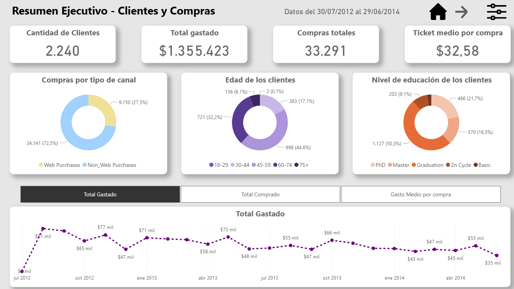

# 🚀 Portfolio de Análisis de Datos

¡Hola! Soy Ezequiel, Profesional del Marketing con más de 10 años de trayectoria y experiencia en posiciones de análisis de datos e inteligencia de negocio.
Este portfolio reúne mis principales proyectos en análisis y visualización de datos.

---
## 📌 Proyectos

### 1. Dashboard de Marketing
**Descripción:**  
Reporte en Power BI que analiza datos de clientes y compras para entender patrones de consumo y comportamiento.  

**Objetivos:**  
- Identificar gasto total, número de compras y ticket medio.  
- Analizar la segmentación por estado civil, educación e hijos.  
- Evaluar el comportamiento multicanal.  
- Detectar los productos con mayor ticket medio.  

**Herramientas utilizadas:**  
- Python (Limpieza y preparación de los datos).
- BigQuery (almacenamiento y preparación de los datos).
- Power BI (modelado, DAX, visualizaciones).  
  
**Principales insights:**  
- Alta proporción de clientes multicanal.  
- Vinos y carnes concentran gran parte del ticket medio.  
- Diferencias claras en el gasto según perfil demográfico.  

**Vista previa:**  
  

**Ver más:**  
➡️ [Detalle del proyecto](proyectos/marketing_powerbi.md)
---

## 🛠️ Herramientas que utilizo
- **Power BI** → Dashboards interactivos y DAX.    
- **SQL** → Consultas y modelado de bases de datos.  
- **Excel** → Reporting y análisis rápido.
- **Python** → Limpieza y análisis de datos (Pandas, Matplotlib, Seaborn).

---

## 📬 Contacto
- 💼 [[LinkedIn]([https://www.linkedin.com/in/ezequielbochicchio/]) ](https://www.linkedin.com/in/ezequielbochicchio/) 
- 📧 [Email](mailto:ezequiel.bochicchio88@gmail.com)  
- 🐙 [GitHub](https://github.com/tuusuario)  

---
✍️ *Este portfolio está en constante actualización con nuevos proyectos.*
